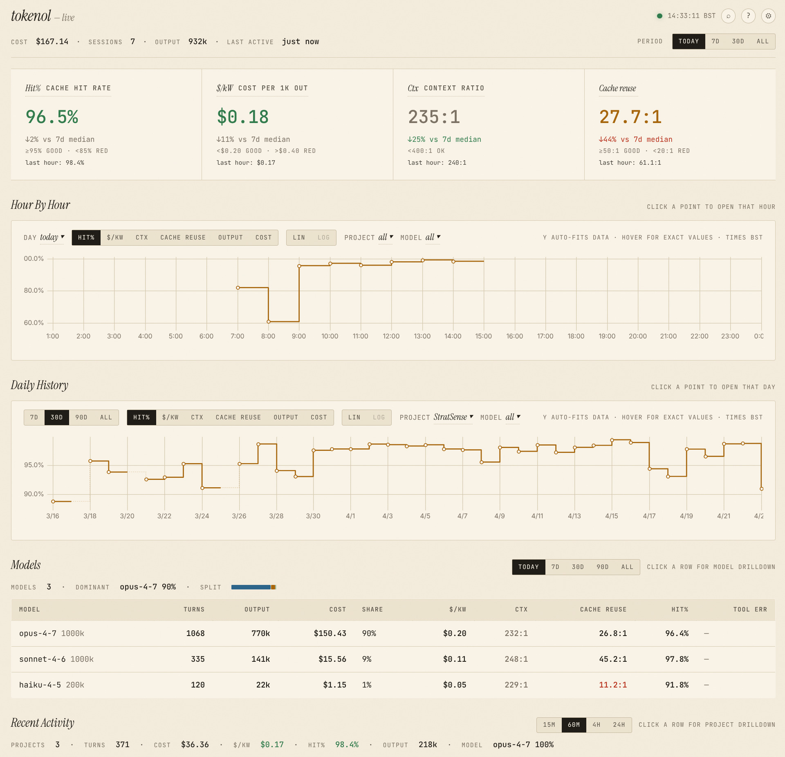
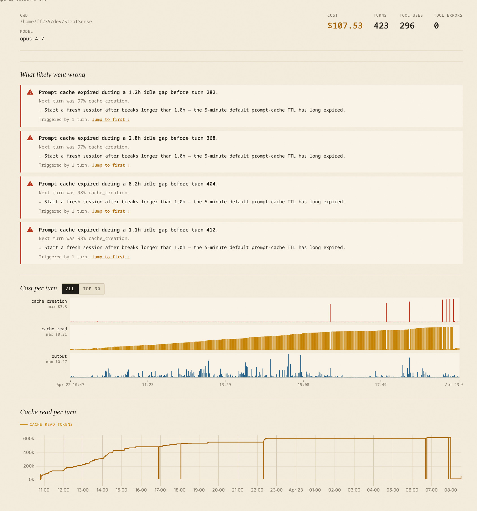
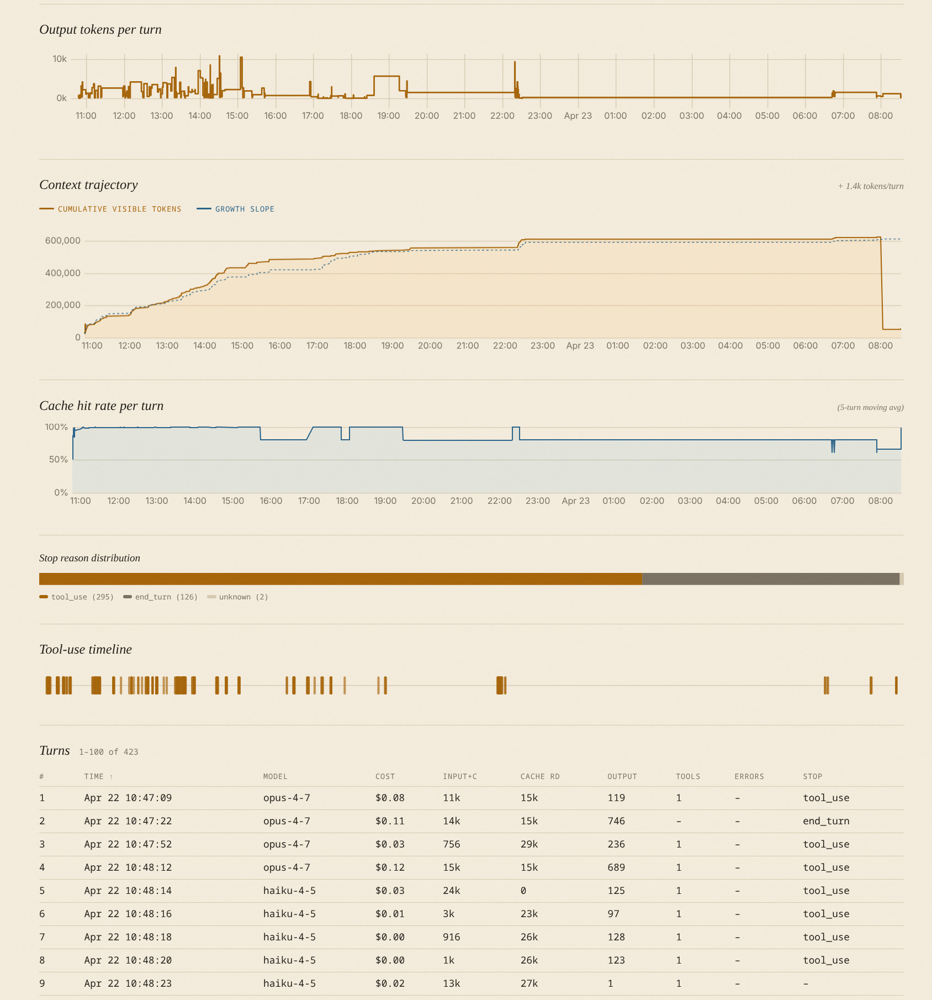
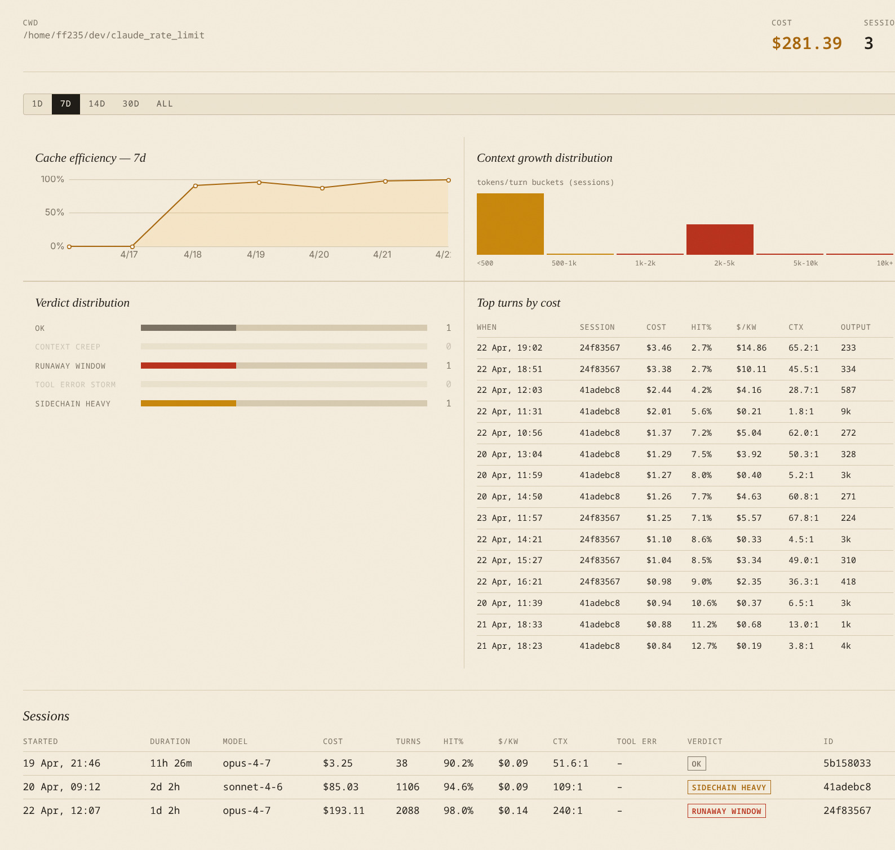

# tokenol

[](https://pypi.org/project/tokenol/)
[](https://pypi.org/project/tokenol/)

Audit [Claude Code](https://claude.com/claude-code) JSONL session logs for cost, cache health, context blow-ups, and 5-hour rate-limit pressure.

`tokenol` parses the session transcripts that Claude Code writes to `~/.claude*/projects/**/*.jsonl` and produces per-day, per-session, per-project, and per-model rollups — plus a live burn-rate view for the active 5-hour window.

## Why tokenol

Claude Code bills you for everything the model reads — input, output, **and** cache creation/reads. When the prompt cache is working, 95%+ of your context tokens cost a tenth of full input price. When it isn't — idle gaps past the 5-minute TTL, context compaction, two sessions in the same repo thrashing each other — the same conversation can cost 10× more without looking any different.

`tokenol` tells you which sessions, projects, and hours did that, and usually why. You run it locally over the JSONL logs Claude Code already writes; nothing is uploaded anywhere.

## Dashboard



Session drill-down — pattern detection + cost-per-turn small multiples:




Project page — cache efficiency trend, verdict distribution, top turns:



## Install

```bash
pipx install tokenol
```

Requires Python 3.10+. See [tokenol on PyPI](https://pypi.org/project/tokenol/).

## Quick start

```bash
# Daily token / cost aggregates over the last 14 days
tokenol daily

# Hourly breakdown for today
tokenol hourly

# Top 10 most expensive sessions in the last 30 days
tokenol sessions --since 30d --top 10 --sort cost

# Per-project rollup
tokenol projects

# Live view: burn rate + projected end-of-window cost
tokenol live --last 20m
```

All commands scan every JSONL file under `$CLAUDE_CONFIG_DIR` (falling back to the standard `~/.claude*` locations) and deduplicate turns using the same `message.id:requestId` compound key that [ccusage](https://github.com/ryoppippi/ccusage) uses.

### Scanning multiple projects

If you use workspace isolation (one `~/.claude-<project>` directory per repo, pointed at via `CLAUDE_CONFIG_DIR`), `tokenol` by default only sees the currently-active project. Pass **`--all-projects`** (or `-A`) to any command to scan every `~/.claude*` directory and get a cross-project view:

```bash
# Total spend across every project in the last 14 days
tokenol daily --since 14d --all-projects

# Which sessions cost the most, globally
tokenol sessions --since 30d --top 10 -A
```

You can also set `CLAUDE_CONFIG_DIR` to a colon- or comma-separated list of paths to scan a specific subset.

## Commands

| Command    | What it shows                                                               |
| ---------- | --------------------------------------------------------------------------- |
| `daily`    | Per-day tokens (input, output, cache read/creation), cost, turn count       |
| `hourly`   | Per-hour breakdown for a single day (defaults to today)                     |
| `live`     | Active 5-hour window burn rate, recent-activity rate, projected final cost  |
| `sessions` | Per-session detail table with blow-up verdict (RUNAWAY, CONTEXT_CREEP, …)  |
| `projects` | Per-project rollup grouped by `cwd`                                         |
| `models`   | Per-model rollup with tool-use counts and error rates                       |
| `verify`   | Cross-check tokenol totals against `ccusage --json` (if installed)          |
| `serve`    | Launch a local browser dashboard with live burn-rate gauge and all panels   |

Every command accepts:

- `--since 14d` — lookback window (e.g. `7d`, `30d`, or an ISO date)
- `--all-projects` / `-A` — scan every `~/.claude*` directory (ignores `CLAUDE_CONFIG_DIR`)
- `--strict` — exit non-zero if any cost-computation assumption fired
- `--show-assumptions` — always print the assumption footer
- `--log-level debug|info|warning`

`tokenol sessions` additionally takes `--sort` (`cost`, `input`, `output`, `cache_read`, `turns`, `max_input`, `duration`) and `--top`.

`tokenol live` takes `--last 20m|2h|30s` and exits non-zero if the projected window cost exceeds the configured reference.

## Live dashboard

```bash
# Install with dashboard dependencies
pipx install 'tokenol[serve]'

# Start the dashboard (binds to http://127.0.0.1:8787)
tokenol serve

# Cross-project view, faster tick, custom reference threshold
tokenol serve --all-projects --tick 2s --reference 25

# Open browser automatically
tokenol serve --open
```

The dashboard updates via SSE as Claude Code writes events to disk. Main page layout (top to bottom):

| Panel | What it shows |
|---|---|
| **Topbar** | Today's cost · sessions · output · last-active time; global period selector (Today / 7D / 30D / All) |
| **Efficiency tiles** | Hit% · $/kW · Ctx · Cache reuse — each with a delta chip vs 7-day median and colour-coded threshold |
| **Hour By Hour** | Hourly metric timeline with day-picker, metric pills, project/model filters, and click-to-drilldown |
| **Daily History** | 30-day metric history with 7-day moving average overlay; range pills (7D / 30D / 90D / All) |
| **Models** | Per-model cost, turns, output, and efficiency metrics; local range override; click row → `/model/<name>` |
| **Recent Activity** | Active projects in the last 60 min with Ctx used, $/kW, hit%, verdict; sortable; click row → `/project/<cwd>` |

Keyboard shortcuts: `?` Glossary · `/` Find · `,` Settings · `Esc` close/back · `g t` scroll to top · `↑↓ Enter` table row navigation · `← →` chart cursor.

### Efficiency metric glossary

| Metric | Definition | Target |
|---|---|---|
| **Hit%** | `cache_read / (cache_read + cache_creation + input)` | ≥ 95% |
| **$/kW** | `cost × 1000 / output_tokens` — dollars per 1k output tokens | < $0.20 |
| **Ctx** | `cache_read / output` as N:1 — context tokens read per output token | < 400:1 |
| **Cache reuse** | `cache_read / cache_creation` as N:1 — low = cache thrashing | > 50:1 |
| **Ctx used** | Latest turn's visible context ÷ model context window | < 85% |

### Preferences

User preferences (tick cadence and threshold overrides) are saved to:

```
$XDG_CONFIG_HOME/tokenol/prefs.json   # default: ~/.config/tokenol/prefs.json
```

Shape:

```json
{
  "tick_seconds": 300,
  "reference_usd": 50.0,
  "thresholds": {
    "hit_rate_good_pct": 95,
    "hit_rate_red_pct": 85,
    "cost_per_kw_good": 0.20,
    "cost_per_kw_red": 0.40,
    "ctx_ratio_red": 400.0,
    "cache_reuse_good": 50.0,
    "cache_reuse_red": 20.0
  }
}
```

Reset to defaults via the Settings modal (`POST /api/prefs {"thresholds": "reset"}`).

### Session drill-down

Click any session to open the drill-down page (`/session/<id>`). It shows:

- **What likely went wrong** — automated pattern cards at the top of the page, each with a headline, the measurable signal that triggered it, and a suggested fix. Five patterns are detected:

  | Pattern | Signal |
  |---|---|
  | **Idle expiry** | Gap ≥ 1 h between turns + next turn was ≥ 80% cache_creation — the 5-minute prompt-cache TTL expired |
  | **Compaction re-inflation** | Visible-token count dropped then climbed back to ≥ 80% of the previous peak — compacting but immediately refilling the context |
  | **Context ceiling plateau** | ≥ 20 consecutive turns at ≥ 90% of the model's context window — paying near-full-context input rates throughout |
  | **Sidechain explosion** | Sidechain/task-agent work accounts for > 40% of session cost |
  | **Tool error storm** | > 20% error rate across any 10-turn window |

- **Cost per turn** — stacked bar chart (input / output / cache_read / cache_creation). Toggle "All" or "Top 30" to focus on the most expensive turns. Click any bar to open the per-turn detail modal.

- **Per-turn modal** — cost component breakdown, token counts, tool call results (✓/✗), first 500 chars of the user prompt and assistant preview. Navigate with ← / → or close with Esc.

## What it detects

For every session, `tokenol` computes a blow-up verdict against spec-defined thresholds:

| Verdict (table label)         | Trigger                                                |
| ----------------------------- | ------------------------------------------------------ |
| `RUNAWAY_WINDOW` (`runaway`)  | Any 5-hour window costs ≥ \$50                         |
| `CONTEXT_CREEP` (`ctx-creep`) | Max single-turn input ≥ 500k **and** growth ≥ 2k/turn  |
| `TOOL_ERROR_STORM` (`tool-errs`) | ≥ 10 tool uses with > 30% error rate                |
| `SIDECHAIN_HEAVY` (`sidechain`) | Sidechain session costing > \$5                      |
| `OK` (`ok`)                   | Everything else                                        |

### Daily efficiency columns

The `tokenol daily` report shows these cost/cache efficiency ratios:

| Column | Meaning | Target |
|---|---|---|
| `$/kW` | USD per 1,000 output tokens | `< $0.20` |
| `Ctx` | Context tokens read per output token (N:1) | lower is better |
| `Cache reuse` | Cache reads per cache-creation token (N:1) | `> 50:1` |
| `Hit%` | % of context served from prompt cache | `≥ 95%` |

## Pricing

Flat per-model rates (no 1M-token tier surcharge — matches ccusage's default behaviour). The current registry lives in `src/tokenol/metrics/cost.py`. When a turn's model isn't in the registry, `tokenol` records an `UNKNOWN_MODEL_FALLBACK` assumption tag and uses a conservative default; run with `--show-assumptions` or `--strict` to surface these.

See [`docs/METRICS.md`](docs/METRICS.md) for metric definitions and [`docs/ASSUMPTIONS.md`](docs/ASSUMPTIONS.md) for the full list of assumption tags.

## Development

```bash
git clone https://github.com/farhanferoz/tokenol
cd tokenol
uv sync --extra dev
uv run pytest
uv run ruff check
```

## Licence

MIT
